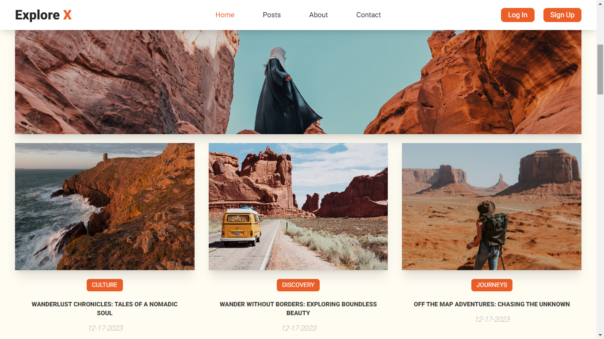

# 
TRAVEL TO THE GREAT BEYOND AND NEVER STOP!

To support me, give star⭐ to this repository please.
I appreciate your support in advance. ❤

### 
🔧Technologies:

  

  

--------------------------------------------------------------

  

You can visit and explore in the <a href="https://travel-blog-plum.vercel.app/" target="_blank">ExploreX</a>.

📌Please Use VPN to see the site.

